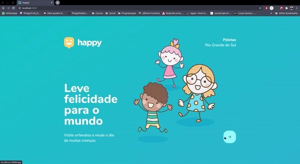

<h1 align="center">
  
  
</h1>
<ul>
<li><a href="#sobre"> Sobre</a></li>
<li><a href="#tecno"> Tecnologias</a></li>
<li><a href="#run"> Como rodar o projeto em seu computador </a></li>
</ul>

<h2 id="sobre">
📜 Sobre:
</h2>
<p align="justify">
O Happy é uma plataforma criada ao longo da terceira edição da Next Level Week da Rocketseat. Sua intenção é conectar pessoas a casas de acolhimento institucional, oferecendo a possibilidade de visitar algum desses espaços e levar alegria às crianças que lá habitam.
</p>
<p align="justify">
O desenvolvimento da aplicação foi feita em três etapas: Front-end criado em React, Back-end em NodeJS e a versão mobile em React Native.
</p>
<p align="justify">
As funcionalidades desenvolvidas incluem página inicial, mapa com busca de dados no back-end listando todas Casas Institucionais cadastradas, página com detalhes sobre a Casa Institucional selecionada e possibilidade de cadastrar novas Casas Institucionais via Front-end ou Mobile direto no Back-end.
</p>

<h2 id="tecno">
🚀 Tecnologias:
<h2>

<h3> Para o Back-end foram utilizados: </h3>
<ul>
<li>Node.js</li>
<li>Express</li>
<li>Typescript</li>
<li>TypeORM</li>
<li>SQLite</li>
<li>TS-Node-Dev</li>
<li>Cors</li>
<li>Yup</li>
</ul>

<h3> Para o Front-end foram utilizados: </h3>
<ul>
<li>React</li>
<li>Typescript</li>
<li>Axios</li>
<li>React Icons</li>
<li>Yup</li>
<li>Leaflet</li>
<li>React Leafleat</li>
</ul>

<h3> Para o Mobile foram utilizados: </h3>
<ul>
<li>React</li>
<li>React Native</li>
<li>Typescript</li>
<li>Expo</li>
<li>React Navigation</li>
<li>Axios</li>
<li>Expo Google Fonts</li>
<li>React Native Maps</li>
</ul>

<h2 id="run">
💻 Como rodar em seu computador:
</h2>

<p>
Clone o repositório e instale as dependências:
</p>

<h3> Back-end </h3>

```
# clonar o repositório:
git clone git@github.com:ThiagoPederzolli/nlw3_omnistack.git

# navegue até a pasta:
cd nlw3_omnistack/backend

# instale as dependências:
npm install

# rode as migrations:
npm run typeorm migration:run

# inicie o servidor:
npm run dev
```

<h3> Front-end </h3>

```
# abra outro terminal na pasta raiz nlw3_omnistack e navegue para web:
cd web

#instale as dependências:
npm install

# rode o projeto:
npm start
```
<h3> Mobile </h3>

<h4> Para conseguir trabalhar com a versão mobile, você precisar trabalhar com o Expo, pois foi como essa aplicação foi desenvolvida, para isso acesse <a href="https://expo.io/learn">Expo</a> para iniciar o projeto e depois continue com as instruções.</h4>

```
# abra outro terminal na pasta raiz nlw3_omnistack e navegue para mobile:
cd mobile

# instale as dependências:
npm install

```
<h4> Você também vai precisar fazer uma alteração na pasta api.ts: </h4>

```
  baseURL: 'http://192.168.1.5:3333',
```
<p> substitua http://192.168.1.5 pelo IP de seu computador </p>

```
# rode o projeto:
npm start
```

<h4> O Expo irá abrir uma página no seu navegador que irá gerar um QRCode para que você possa abrir a aplicação direto em seu celular, lembre-se que é preciso ter o aplicativo Expo instalado no celular. </h4>

------------

<h1 align="center">
 
</h1>

<p align="center"> Desenvolvido por © Thiago Pederzolli Machado da Silva! </p>